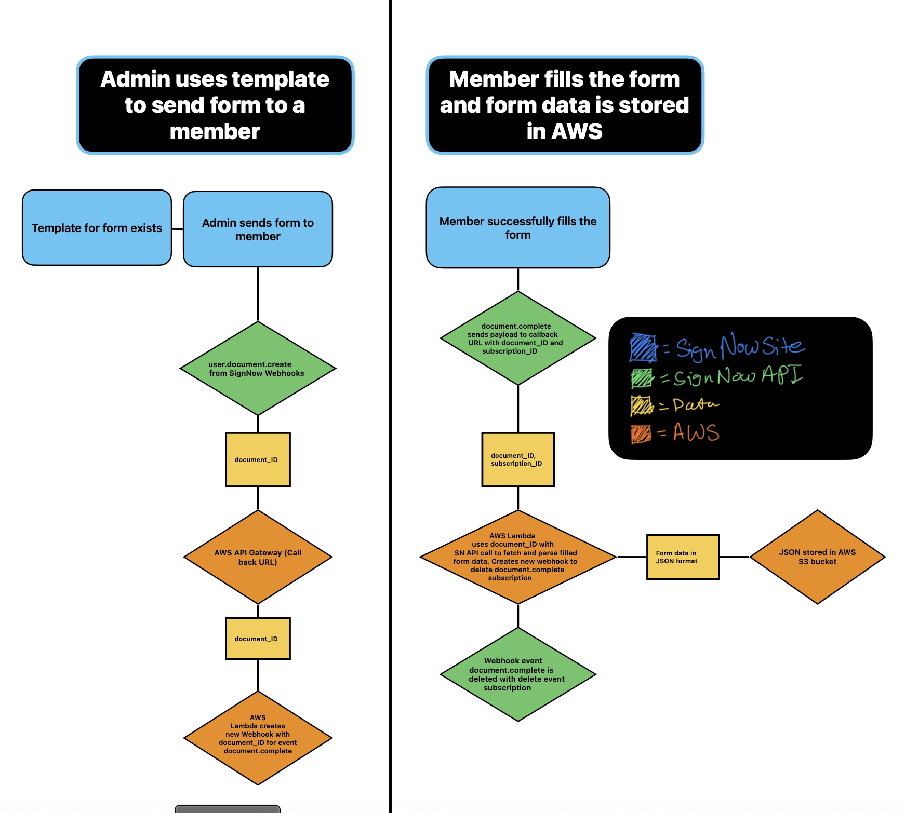

# Getting and Storing Signed Documents with SignNow API

**Goal**: Use Sign-Now API endpoint to retreive all documents fields and store the JSON of the document in an AWS S3 Bucket

### Approach One (AP1/)
* Sign-Now API Endpoint to retreive all documents within a specified time frame. Run the Go binary in AWS Lambda and store in AWS S3
    - Didn't go as planned, after testing I realized regardless of the filter put on the API endpoint, there was no filtering through dates. Ex. (https://api.signnow.com/user/documentsv2?filter[updated][gte]=%s&filter[updated][lte]=%s)

### Approach Two (createDocumentCompleteWebhook & getParseAndSaveDocument)
  1. Event (**user.document.create**) webhook for Admin is created to track when Admin sends a new document to be signed. When admin creates document, Webhook sends payload to callback, AWS API Gateway URL which contains the document_ID.
   
  2. document_ID goes to AWS Lambda function (**createDocumentWebhook**) which uses the document_ID to create a new event (**document.complete**) webhook. After the document is signed the from the webhook payload sends the document_ID and the Webhook subscription_ID to another AWS Lambda Function (**getParseAndSaveDocument**)
   
  3. **getParseAndSaveDocument** has four important steps:
     1. Get the document from SignNow using the SignNow API (https://docs.signnow.com/docs/signnow/document/operations/get-a-document) as a JSON
     2. Parse the returned JSON and omit extra fields and only keep fields which are important such as: Date created/signed, signed user email, signed user inputs(text fields, checkboxes, radio fields, and base64 encoded signature)
     3. After the JSON is collected and cutdown, the JSON is then sent to AWS S3 Storage bucket for safe keeping. Each document is formated as follows signed-{firstName}-{lastName}-{date}.json
     4. Another webhook event is called using the subscription_ID mentioned previously to delete the Webhook that was used to send the document.complete. This is done to prevent too many webhooks from being created, as they do not delete on their own

   